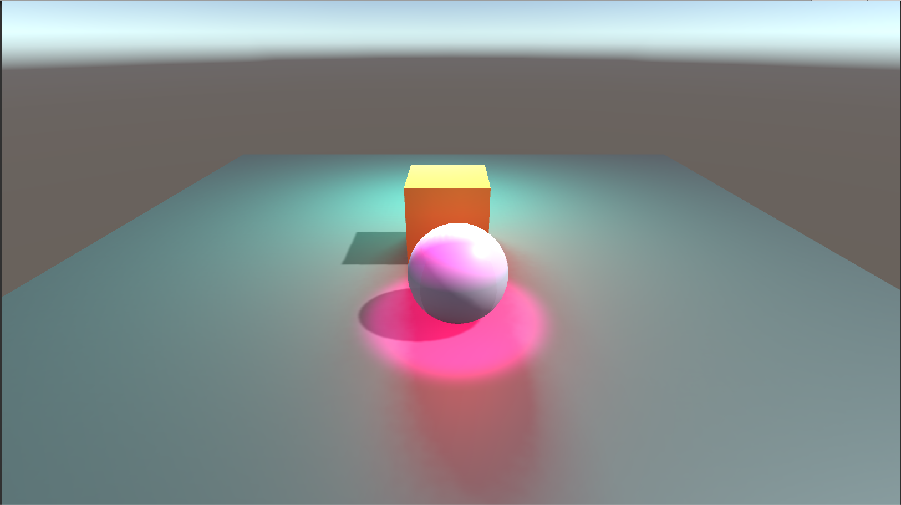
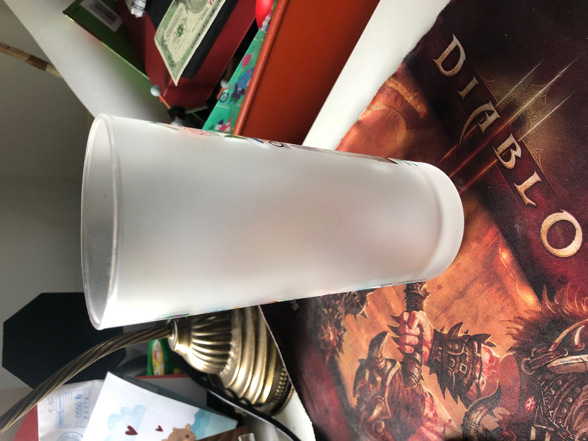
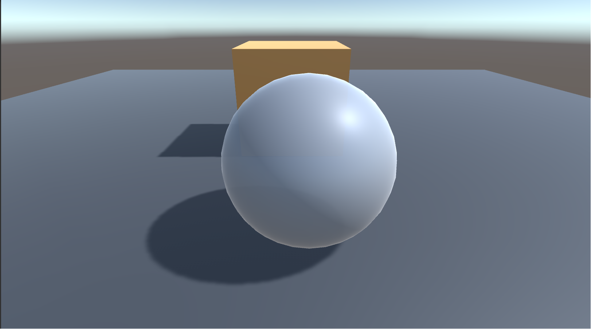
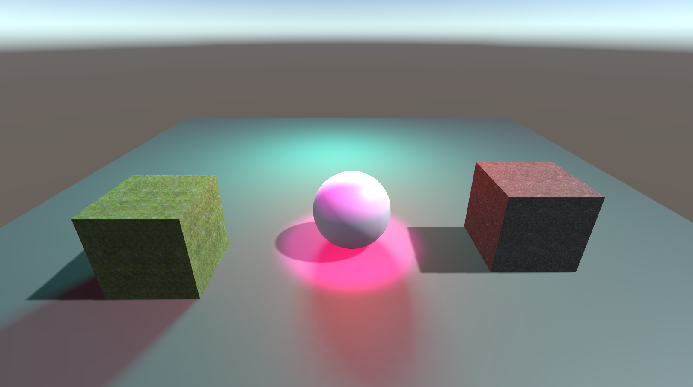
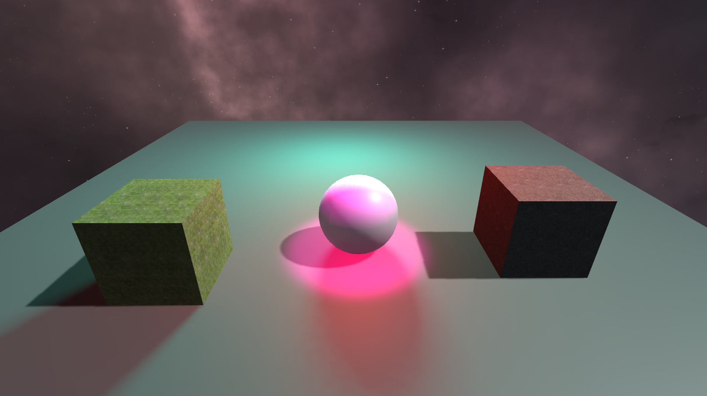

#Types of lights:

-Point Light: It behaves like a bare lightbulb. It illuminates the scene 
according to its position. Its rotation has no effect.
-Directional Light: It behaves like the sun. It illuminates all object in the scene, 
lighting them based on the direction of the gameobject. Its position in the scene is irrelevant.
Spot Light: It behaves like a flashlight or headlights on a car. It points in a direciton based 
on the rotation of the gameobject and illuminate all objects in a cone. It illumnates objects 
based on both position and rotation of the gameobject.
Area Light: It only works while baking a lightmap. It shines in all directions to one side of a rectangular plane.

#Material:
original

material in unity

#Textures:

Cube on the left: grass texture
Cube on the right: stone texture
(I found both of these textures on the unity asset store for free)

#Skybox:
I used a starfield skybox that I got from the unity asset store for free

