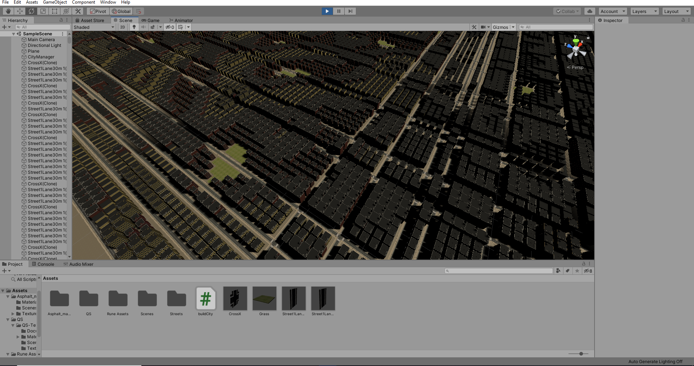
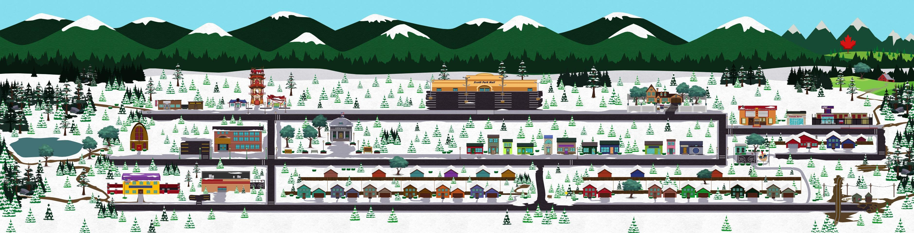
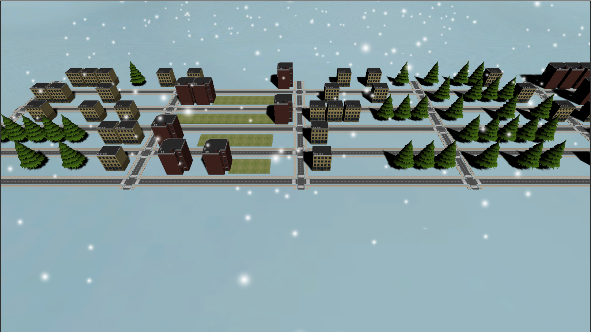

# Lab8  

## My city after the tutorial:  

## South Park, the city that inspired me:   

## Result:  

## What I changed:  

South park is a small city in the middle of nowhere. I reduced the city size, the variety of buildings and added pine trees. In addition to the perlin noise, I added some randomness to the bulding spawns to make them spawn more apart and to include more empty space. I changed the skybox to snowy mountains and the ground texture to snow. I also added particle effects to make it snow in the scene. I tweaked the spawn weights of each element until the layout ended up similar to the reference picture. I wanted to use more cartoonish models, but I was not able to find good ones for free.

## Partner:

I was not able to find my partner as they had not changed their names on discord.
