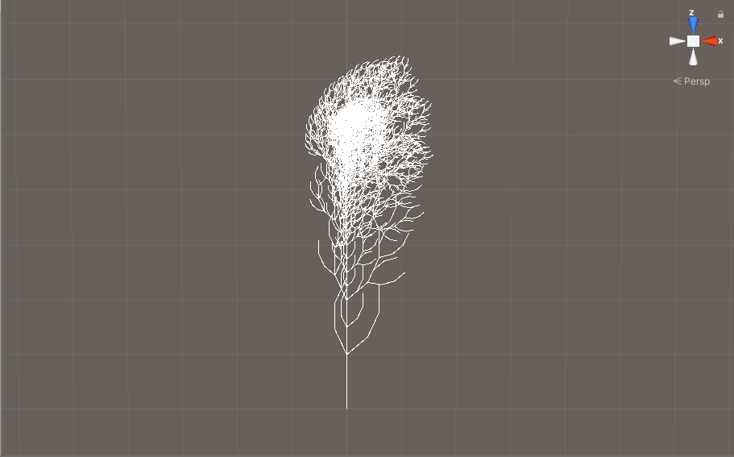
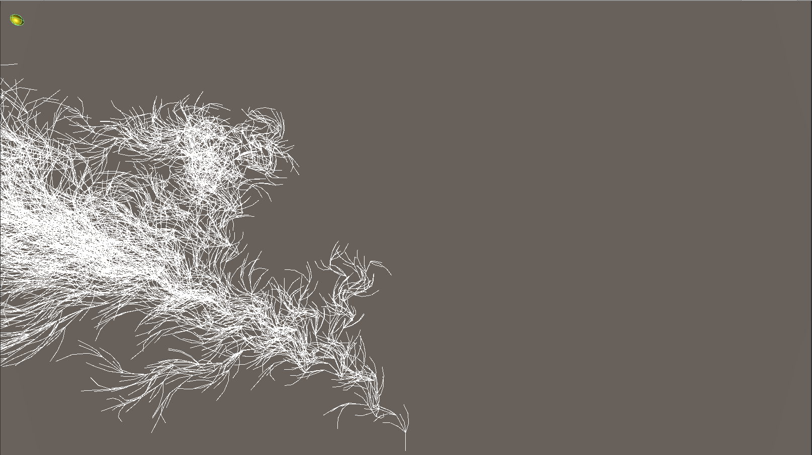
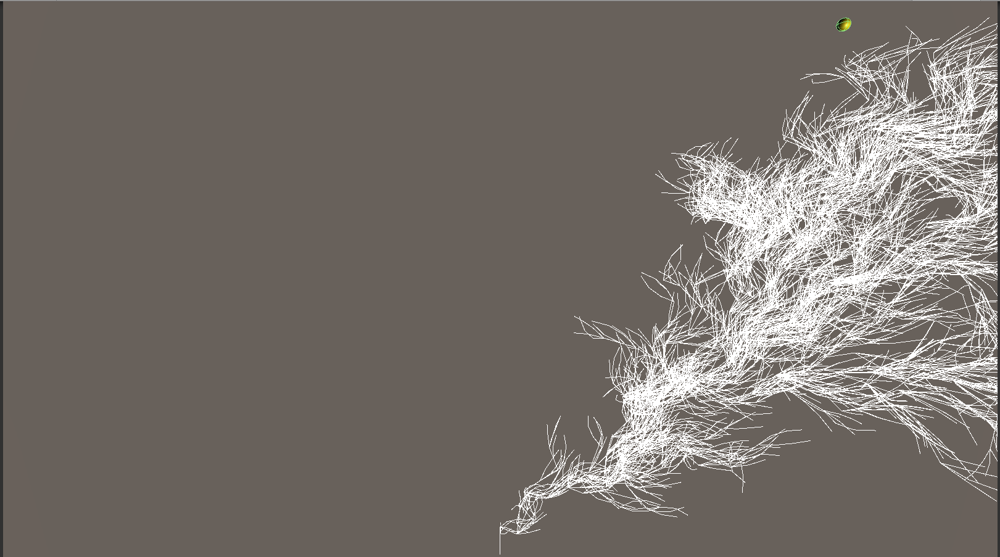

# Lab9  

## My L-system after the tutorial:  

## My own L-system:   

I modified the L-system to lean towards a gameObject as it grows. I like to think of it as the tree gowing towards the sun. Pressing spacebar will start the next round of generation and the L-system will lean towards the yellow sphere as it grows. I changed the rules to F->FF+[+F-F-F]-[F-F]-[-F+F+F] because I liked better how that looked. I changed the angle difference variable to 15 instead of 25 so that I could get it to be a little bit more contained. I calculate the distance between the sun object and the drawing object every frame and normalize it. Then I used this distance variable to modify the change in angle to lean more towards the sun object.

